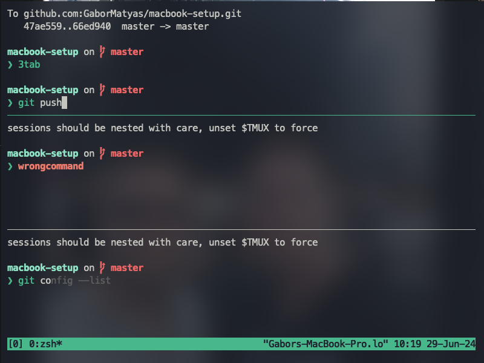

# MacBook Setup

## Introduction
I would like to draw your attention to the fact that this repository was first and foremost tailored to my own needs. If you really want to use it for your benefit, it is better if you take this as a guideline, check the settings and packages that I use, and do not install them with the script. If you still run it as it is, it's definitely your responsibility.

This repository contains scripts and configuration files to set up a new MacBook efficiently. The setup includes essential tools, applications, and settings to streamline your (web development) environment.

## Table of Contents

- [Getting Started](#getting-started)
- [Prerequisites](#prerequisites)
- [Installed packages](#installed-packages)
- [Custom Mac Config](#custom-mac-config)
- [Alacritty Terminal](#alacritty-terminal)
- [Additional Files](#additional-files)

## Getting Started

- Clone this repository
```
https://github.com/GaborMatyas/macbook-setup.git
```
- Navigate to the project folder on your local machine 
- Run the setup.sh
```
./setup.sh
```
The script will ask your approval for the different steps during the installation. 

## Prerequisites
`Homebrew` package is used to install most of the packages. If it is not available, it will be installed automatically. If it is available, it will be updated before the further steps.

## Installed packages
- Git - version control system
- Alacritty - my beloved terminal. You can find a separate section for this one :)
- Slack - for work
- Obsidian - for my notes :)
- Vs Code
- VLC - video player
- Discord 
- Firefox Developer Edition, Goole Chrome, Microsoft Edge
- OBS - screen recorder
- nvm (Node Version Manager)

### MacOS Specific Packages
- [Rectangle](https://rectangleapp.com): Position your windows with keyboard shortcuts, similar to the window snapping feature in Windows OS.
- [AltTab](https://alt-tab-macos.netlify.app): Bring the power of Windows' "Alt-Tab" window switching to macOS, allowing easy navigation between apps.

- [Stats](https://github.com/exelban/stats): A simple macOS system monitor for your menubar, providing detailed information about your system's performance. ([Setp by step youtube video](https://www.youtube.com/watch?t=1111&v=GK7zLYAXdDs&feature=youtu.be))


- [Raycast](https://www.raycast.com): An alternative to Spotlight search, Raycast enhances your workflow by handling file/app opening, providing a calculator, and many more features.

## Custom Mac Config
- Show Path and Status Bar in Finder
- Set Local Search as Default in Finder
- Use List View in Finder by Default
- Auto-hide Dock
- Show Hard Disks, External Disks, CDs, DVDs, Connected Servers and iPods on Desktop
- Disable Show Desktop on Wallpaper Click
- Show All Filename Extensions
- Disable Recent Apps in Dock
- Show Folders First in Finder
- Reverse Scroll Direction (the default feels really unnatural for me)
- Date and time: Hide Date in Menubar, disable AM/PM in Clock, Hide Clock and Battery Icons in Menubar

## Alacritty terminal


### Installed extras
- Nerd fonts (`font-meslo-lg-nerd-font`)
- `alacritty.toml` with mostly visual config + `Ayu Mirage color theme`
- [Starship](https://starship.rs/): It provides extensive customization options for prompt appearance and behavior. (eg: if you want to see the name of your branch in prompt, or get syntax highlighting for your commands)
- [Tmux](https://www.redhat.com/sysadmin/introduction-tmux-linux) ([Github](https://github.com/tmux/tmux))([Tmux Wiki](https://wiki.termux.com/wiki/Main_Page)) - Tmux is a terminal multiplexer that allows you to manage multiple terminal sessions within a single window. So you can use multiple tabs and even multiple windows. This had the biggest impact to my workflow. [Here are my most used keyboard shortcuts for Tmux](tmux-shortcuts.md). 

## Additional files
- `RectangleCustomConf.json` - my shortcuts for the extension
- `further-steps.txt` - some steps that are not automated 
- `zshrc-content-to-add.txt` - my zshrc config + aliases for git and other CLI apps
